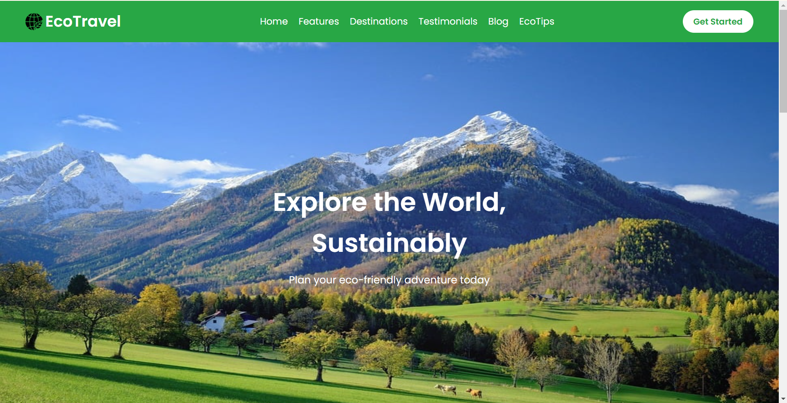
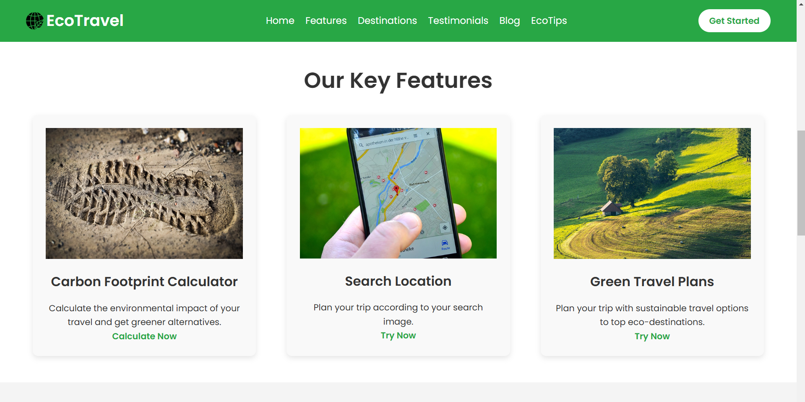
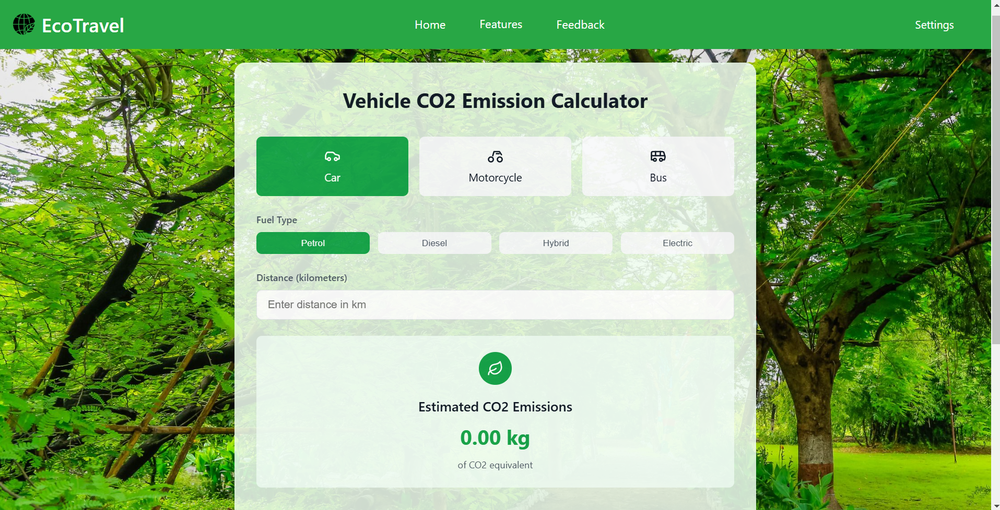
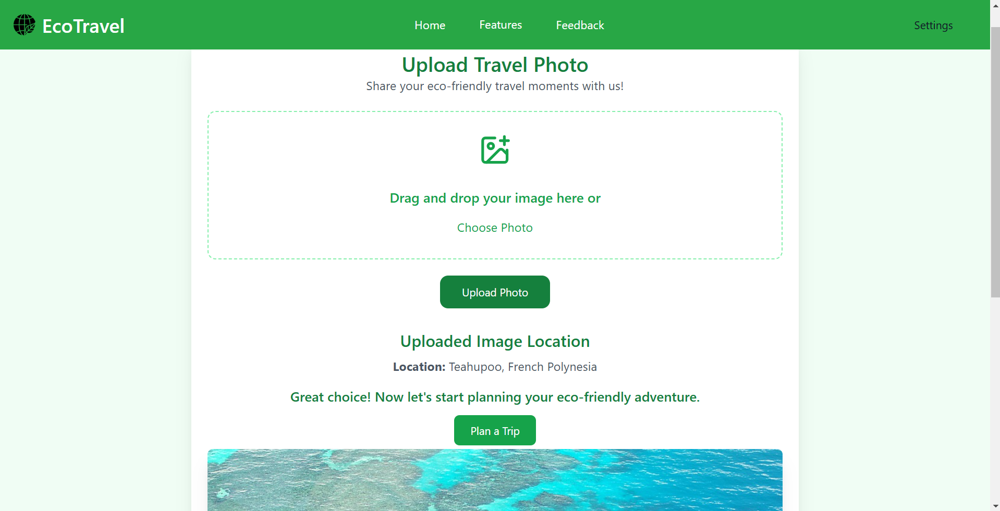
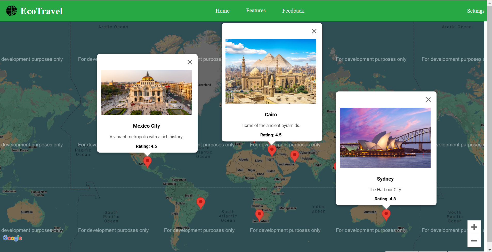
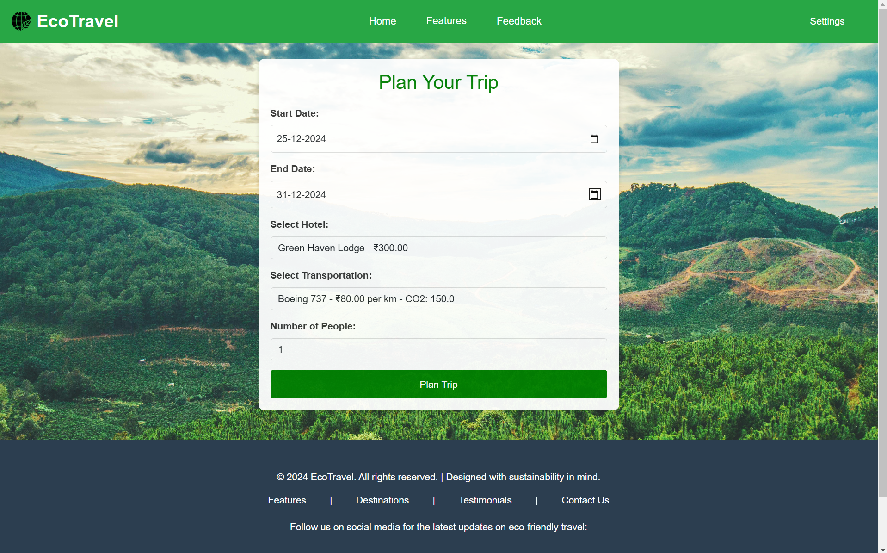
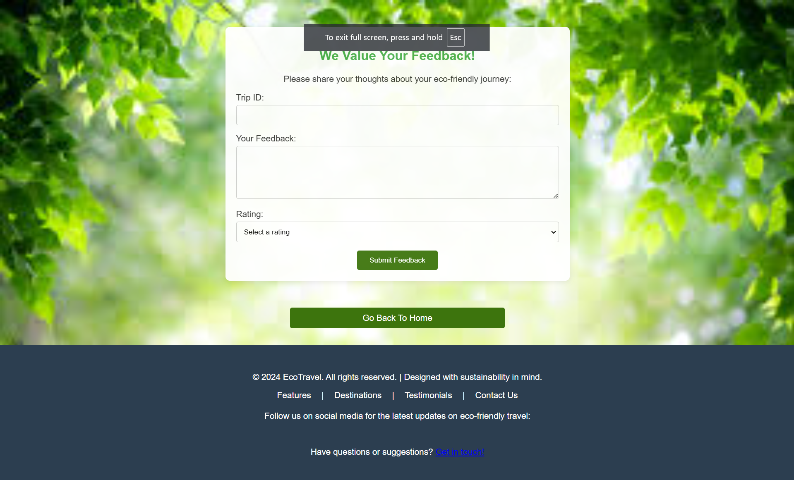
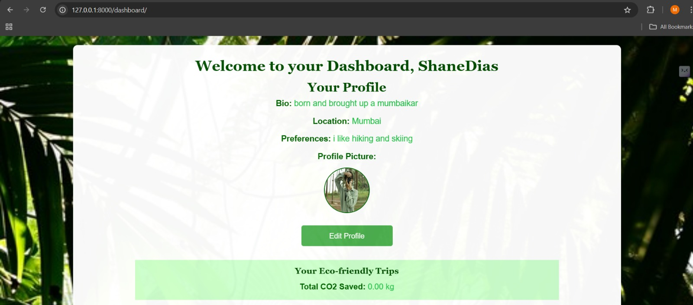

# 🌍 Global Eco-Friendly Travel Planner

*Team: JSM²*

- *Group Members*: Shane Dias, Mayank Mehta, Jacell Jamble, Mayank Bhuvad

---

## 🌱 Project Abstract

*Global Eco-Friendly Travel Planner* is a web platform designed to promote sustainable travel by helping users plan environmentally conscious trips. This project combines functionality with eco-awareness, allowing users to choose eco-friendly transport options, accommodations, and activities while also estimating the carbon emissions saved. The platform encourages responsible tourism and helps users explore the world without harming the environment.

---
## Video
[Watch Video](./destination_images/Global_Eco-friendly_Travel_Planner.mp4)

---
## Screenshots

---

## 🌿 Objectives

- *Facilitate Eco-Friendly Travel Planning*: Create a platform that promotes sustainability by providing green travel alternatives.
- *Offer Sustainable Transport Modes*: Let users choose from public transport, electric cars, cycling, walking, and more, with calculated carbon savings.
- *Help Users Find Eco-Friendly Accommodations*: Display certified eco-friendly hotels and accommodations at destinations.
- *Carbon Footprint Estimation*: Calculate carbon emissions based on travel mode, distance, and transport types, encouraging users to minimize their carbon impact.
- *Promote Eco-Conscious Destinations*: Showcase destinations known for their eco-friendly activities and practices.

---

## 🚀 Key Features

- *Sustainable Travel Search*: Users can search for eco-friendly destinations and select transport modes to calculate carbon emissions.
- *Eco-Accommodations*: A curated list of eco-certified hotels and accommodations based on the user's chosen destination.
- *Sustainable Transport Options*: Public transport, electric vehicles, cycling paths, and walking routes available for selection.
- *Carbon Emission Estimation*: Dynamically calculated based on the mode of transport and travel distance.
- *Interactive and Engaging Design*: A user-friendly interface with clear navigation and interactive features for planning trips.
- *Responsive Layout*: Designed to work seamlessly across all devices—mobile, tablet, and desktop.
- *Destination Recognition Using Images*:  A feature in which a user uploads a unknown Destination image  and in return the exact location and the plan to book a trip to that location is generated

---

This project is a step towards greener travel, offering users a way to explore the world sustainably. Let's travel the globe while keeping our planet safe! 🌎✨
